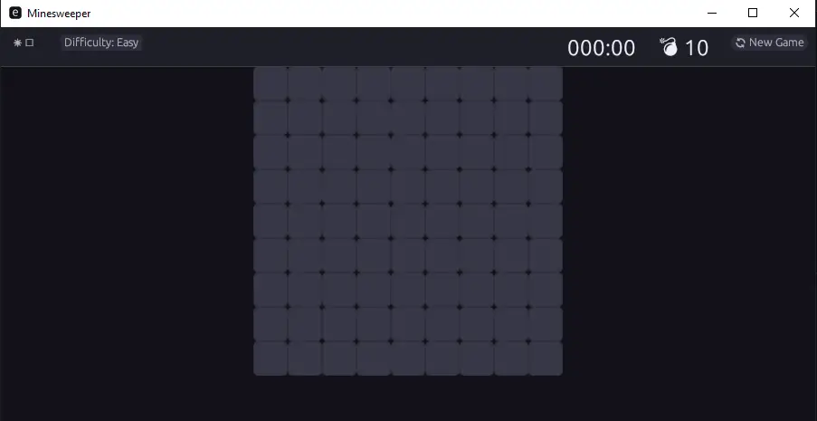

# Minesweeper v2

A modern, cross-platform Minesweeper game built with Rust and egui.


## Overview

A complete implementation of the classic Minesweeper game with a modern, sleek UI. Built with Rust for performance and reliability, using egui for a responsive cross-platform graphical interface.

## Features

### Core Gameplay
- Classic Minesweeper mechanics with reveal, flag, and question mark
- Automatic flood-fill expansion for empty cells
- First-click safety (never hit a mine on the first click)
- Victory and defeat detection

### Difficulty Levels
- **Easy**: 9×9 grid with 10 mines
- **Medium**: 16×16 grid with 40 mines
- **Hard**: 30×16 grid with 99 mines

### User Interface
- Modern, minimalist design with dark/light themes
- Smooth hover effects on cells
- Responsive layout that adapts to window size
- Timer and mine counter
- Game over dialogs with play again option

### Technical
- Cross-platform (Windows, macOS, Linux)
- Fast rendering with native GPU acceleration via egui
- Clean modular architecture
- Zero-copy rendering pipeline

## Screenshots



## Building

### Requirements
- Rust 1.70 or later
- Cargo (included with Rust)

### Build Instructions

```bash
# Development build
cargo build

# Release build (optimized)
cargo build --release

# Run directly
cargo run --release
```

The compiled binary will be at `target/release/minesweeper.exe` (Windows) or `target/release/minesweeper` (Unix).

## Architecture

```
src/
├── main.rs      # Entry point, window setup
├── app.rs       # Main application, UI rendering
├── board.rs     # Board logic and mine placement
├── cell.rs      # Cell state and behavior
├── game.rs      # Game state machine
├── settings.rs  # Difficulty configuration
├── theme.rs     # Dark/light theme colors
└── ui.rs        # Cell painter utilities
```

### Key Components

- **Cell**: Represents a single cell with state (hidden, revealed, flagged) and properties (mine, adjacent count)
- **Board**: Manages the grid, handles reveal/flag operations, flood-fill algorithm
- **Game**: Orchestrates gameplay, timer, win/lose conditions
- **Theme**: Color palette and styling for dark/light modes
- **App**: Main UI component handling rendering and user input

## Controls

| Action | Mouse |
|--------|-------|
| Reveal cell | Left click |
| Place/remove flag | Right click |
| New game | Click "🔄 New Game" |
| Change difficulty | Click difficulty button |

## Technical Details

### Rendering
The game uses immediate mode rendering via egui. Cells are drawn using low-level painter operations for maximum performance. The UI avoids unnecessary allocations by reusing cell data structures.

### First-Click Safety
When the player clicks a cell containing a mine on their first move, the game immediately relocates the mine to another non-revealed cell before processing the click. This guarantees a safe first click every game.

### Flood Fill Algorithm
Empty cells (cells with 0 adjacent mines) trigger an automatic expansion that reveals all connected empty cells and their bordered numbered cells. This is implemented using an iterative stack-based algorithm to avoid stack overflow on large boards.

## Configuration

Difficulty settings are defined in `settings.rs`:

```rust
pub enum Difficulty {
    Easy,                              // 9×9, 10 mines
    Medium,                            // 16×16, 40 mines
    Hard,                              // 30×16, 99 mines
    Custom { width, height, mines },  // Custom dimensions
}
```
